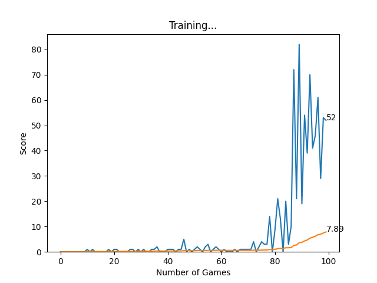
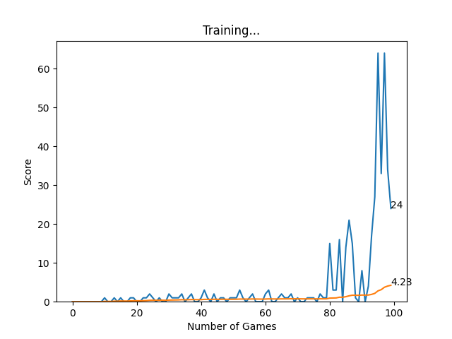

# Snake Game AI (Enhanced Version)

>This repository is a clone of the [patrickloeber/snake-ai-pytorch](https://github.com/patrickloeber/snake-ai-pytorch) project by Patrick Loeber, as featured on the freeCodeCamp YouTube channel. All original code and ideas are credited to Patrick Loeber and freeCodeCamp.

## Objective

The main objective of this clone is to experiment with and improve the AI logic for the Snake game, and to provide a robust, reproducible training and evaluation workflow.

## Key Features & Improvements

- **Fresh Model Per Run:**  
  Every time you run `agent.py`, a new model is trained from scratch and saved as `model/modelX.pth` (where X is an incrementing number).
- **Manual Debugging Mode:**  
  When you start training, you can choose between 'Train' (fastest, no chart window, only saves final plot) and 'Debug' (shows a live chart window, slows down the game for observation). In debug mode, models and plots are saved as `debug_modelX.pth` and `debug_modelX_plot.png` to clearly distinguish them from standard runs.
- **Result Plotting:**  
  After each training session, a plot of the training progress (scores and mean scores) is saved as `results/modelX_plot.png` or `results/debug_modelX_plot.png`, matching the model number and mode.
- **Multiprocessing Plotting:**  
  The training progress plot updates in real time in a separate window (in debug mode), allowing you to interact with both the game and the plot without crashes. The chart window stays on top in debug mode for easy monitoring.
- **Grid-Aligned Snake and Food:**  
  The snake's head and food are always aligned to the grid, ensuring correct collision and scoring behavior.
- **Fixed Board Size for Benchmarking:**  
  The game board size is now always 750x750 for all training runs, ensuring consistent benchmarking and reproducibility.
- **Bug Fixes & Robustness:**  
  - All positions are integers to avoid rendering issues.
  - Model saving and directory creation are robust and error-free.
  - Code is compatible with Windows multiprocessing requirements.
- **Human Play Mode:**  
  Play the game yourself using `snake_game_human.py`.

## Project Structure

- `game.py` - Core Snake game logic and environment (AI version)
- `agent.py` - AI agent and training loop (run this to train a new model)
- `model.py` - Neural network model definition and training logic
- `helper.py` - Utility functions for plotting (used in legacy mode)
- `plot_process.py` - Real-time plotting process for training progress
- `snake_game_human.py` - Play the game as a human
- `model/` - Folder containing all trained models (`model1.pth`, `model2.pth`, ...)
- `results/` - Folder containing all training plots (`model1_plot.png`, `model2_plot.png`, ...)
- `arial.ttf` - Font for rendering text

## How to Use

1. **Train a New Model**
   - Run `python agent.py`
   - You will be prompted to select 'Debug' or 'Train' mode:
     - **Debug:** Shows a live chart window, slows down the game for observation, and saves models/plots as `debug_modelX.pth` and `debug_modelX_plot.png`.
     - **Train:** Runs as fast as possible, no chart window, only saves the final plot and model as `modelX.pth` and `modelX_plot.png`.
   - The chart window in debug mode stays on top for easy monitoring and updates in real time.
   - The board size is always 750x750 for all training runs.

2. **Play as a Human**
   - Run `python snake_game_human.py`

3. **Review Results**
   - All trained models are in the `model/` folder
   - All training plots are in the `results/` folder
   - Debug runs are clearly marked with the `debug_` prefix in their filenames

## Credits

- Original project and tutorial by [Patrick Loeber](https://github.com/patrickloeber/snake-ai-pytorch)
- YouTube video: [AI Learns to Play Snake](https://www.youtube.com/watch?v=L8ypSXwyBds&t=2355s)
- Hosted on [freeCodeCamp](https://www.freecodecamp.org/)

## Next Steps

You can further experiment with the AI logic, try new reward strategies, or tune hyperparameters to improve performance.  
Feel free to fork and contribute! 

## Benchmarking & Results

**Benchmark Settings:**
- Speed: 100
- Width: 750 (now fixed for all training runs)
- Height: 750 (now fixed for all training runs)
- Max Games: 100
- MAX_MEMORY: 100,000
- BATCH_SIZE: 1,000
- LR: 0.001

### Test Results

| Test | Model File         | Plot File                | Notes/Observations |
|------|--------------------|--------------------------|--------------------|
| 1    | model/model1.pth   | results/model1_plot.png  | Max score: 82, Mean score: 7.89. The agent started learning after ~75 games, with a sharp increase in scores and high variance. |
| 2    | model/model2.pth   | results/model2_plot.png  | Max score: 62, Mean score: 4.23. The agent showed improvement after ~80 games, but the overall mean score was lower than run 1. |

### Example Plots

#### Test 1

#### Test 2

### Analysis

- **Learning Trends:**  
  In both runs, the agent showed little progress for the first 70–80 games, then rapidly improved, achieving much higher scores in the final games. This is typical for reinforcement learning, where the agent needs time to explore before it starts exploiting learned strategies.
- **Best Scores:**  
  - Run 1: 82 (mean: 7.89)
  - Run 2: 62 (mean: 4.23)
- **Observations:**  
  - There is significant variance in the scores after the agent starts learning, indicating that while the agent can achieve high scores, it is not yet fully consistent.
  - The mean score remains much lower than the best score, showing that high scores are occasional rather than regular.
  - The plot title is missing and displays as "training" due to a minor code issue (see below).

### Note on Plot Titles

The saved plots now show the model name (e.g., `model1_plot` or `debug_model1_plot`) as the chart title, making it easy to identify which run the plot belongs to. 